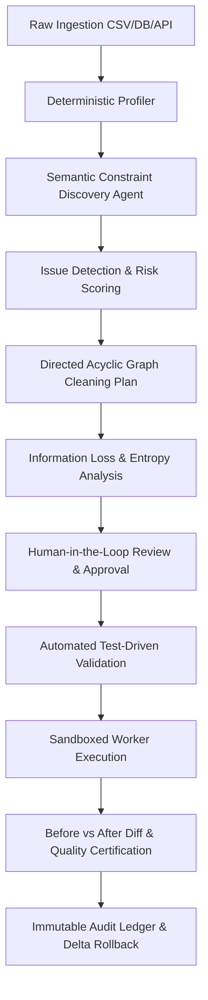

# PurifyOps — Agentic Data Cleaning Planner (PNG6)
## Enterprise Architecture & Technical Specification

### 1. Executive Summary & Problem Scope
Enterprise datasets suffer from systemic data debt: subtle duplicates, fragmented formats, semantic drift, and orphan keys. Existing automated cleaning tools blindly apply destructive heuristics or rely on naive LLM prompting that leaks context, hallucinates corrections, and destroys irreversible information.

**PurifyOps** solves this by combining:
1. **Deterministic Profiling & Statistical Bounds** (Polars / PyArrow)
2. **Semantic Constraint Reasoning** (Agentic LLM Planner)
3. **Formal Information Loss Estimation** (Shannon entropy and field edit distance)
4. **Human-in-the-Loop Safeguards** (Probabilistic entity resolution approval)
5. **Reversible Delta Execution** with automated rollback verification.

---

### 2. Multi-Stage Pipeline Lifecycle

---

### 3. Core Architectural Layers

| Layer | Level 1 Implementation | Level 2 Target Stack |
| :--- | :--- | :--- |
| **Frontend UI/UX** | High-performance Vanilla SPA (HTML5/CSS3/ES6 modules) with Zero Build Dependencies, Enterprise Theme & State Management | Next.js 14 / TypeScript / Tailwind-neutral tokens |
| **API Client** | Asynchronous Mock Data & Service Provider Layer (`apiService.js`) matching OpenAPI 3.1 contracts | FastAPI / ASGI with Pydantic v2 schemas |
| **Storage & State** | In-Memory Reactive Store with LocalStorage Persistence | PostgreSQL 16 + Redis for Celery task queuing |
| **Data Engine** | Realistic column-level profiles and delta-calculation algorithms | Polars + DuckDB execution within Docker sandbox |
| **Agentic Planner** | Structured DAG plan generation simulator with confidence scoring | LangGraph + Claude 3.5 Sonnet / GPT-4o with tool-use verification |

---

### 4. API Endpoints Specification

#### Projects & Datasets
- `GET /api/v1/projects` - List all data cleaning projects
- `POST /api/v1/projects` - Create project and register source configuration
- `POST /api/v1/projects/{id}/upload` - Multipart ingestion with schema pre-flight scan
- `GET /api/v1/projects/{id}/overview` - Dataset metadata & 4-dimension quality score
- `GET /api/v1/projects/{id}/profile` - Detailed column profile with statistical boundaries

#### Issues & Plan Generation
- `GET /api/v1/projects/{id}/issues` - List detected anomalies, duplicates, and violations
- `POST /api/v1/projects/{id}/plan/generate` - Trigger Agentic DAG plan synthesis
- `GET /api/v1/projects/{id}/plan` - Retrieve current cleaning plan and operation steps
- `GET /api/v1/projects/{id}/impact` - Retrieve information loss and entropy calculations

#### Review & Execution
- `GET /api/v1/projects/{id}/review/duplicates` - Fetch candidate duplicate pairs
- `POST /api/v1/projects/{id}/review/decision` - Submit human decisions (Merge/Keep/Ignore)
- `POST /api/v1/projects/{id}/validate` - Run pre-execution test-driven validation suite
- `POST /api/v1/projects/{id}/execute` - Launch sandboxed pipeline execution
- `GET /api/v1/projects/{id}/results` - Fetch before/after delta metrics & quality certificate
- `GET /api/v1/projects/{id}/audit` - Fetch immutable transformation history
- `POST /api/v1/projects/{id}/rollback/{step_id}` - Revert specific transformation delta

---

### 5. Information Loss Formulation
To safeguard against destructive data loss, the planner calculates:
$$\Delta H = H(X_{\text{raw}}) - H(X_{\text{cleaned}})$$
Where $H(X)$ represents empirical Shannon entropy across target distributions. Transformations resulting in $\Delta H > 0.15$ are automatically flagged for strict human approval.
